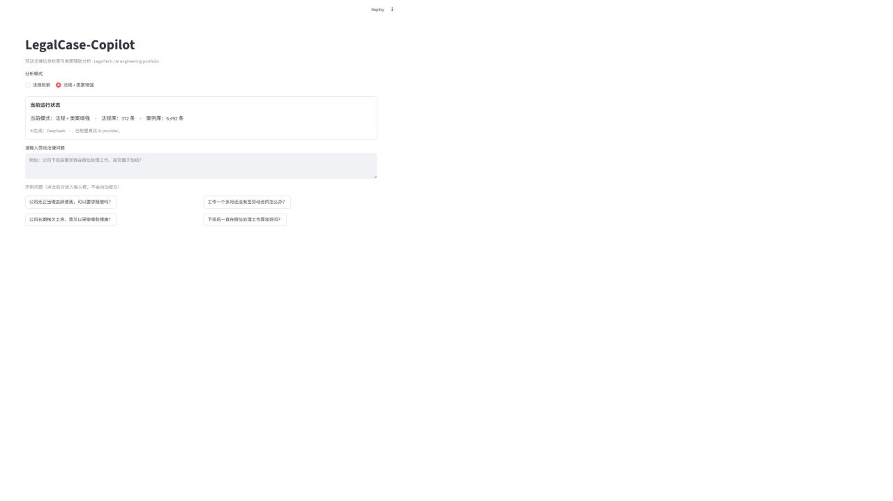
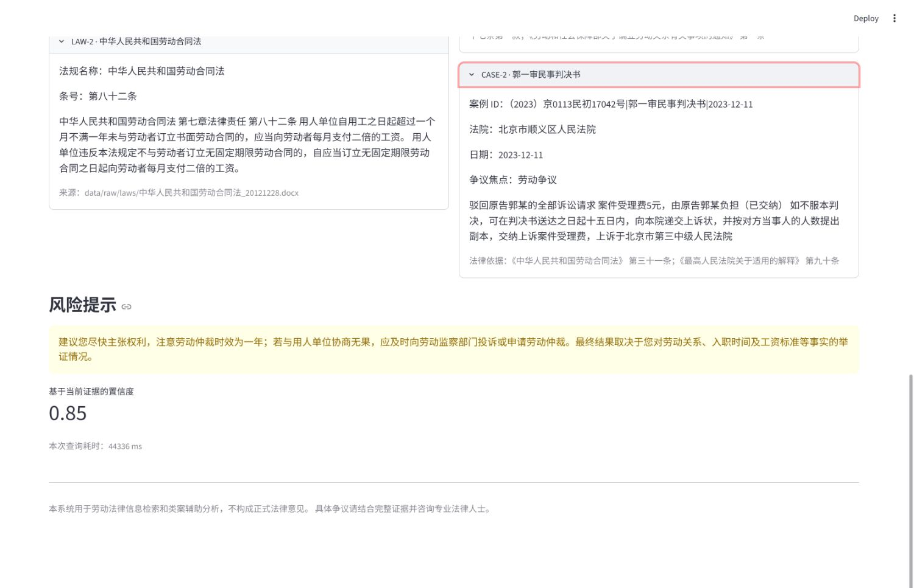

# LegalCase-Copilot

## 劳动法律信息检索与类案辅助分析系统

An AI-powered labor-law retrieval and case-augmented RAG assistant with hybrid retrieval, cross-encoder reranking, grounded generation, and citation validation.

LegalCase-Copilot is an engineering-oriented research and demonstration system for labor-dispute legal information retrieval. It implements a complete retrieval → reranking → context building → generation → validation pipeline rather than simply forwarding a question to an LLM API.

## Project Overview

The system combines 372 article-level labor-law and judicial-interpretation records with a 6,492-case public labor-dispute corpus, BM25 sparse retrieval, dense semantic retrieval, hybrid fusion, cross-encoder reranking, DeepSeek-compatible grounded generation, deterministic LAW/CASE citations, citation validation, article sanitization, and safe fallback.

The 6,492-case production corpus and its generated embeddings are external runtime assets. They are not included in this repository.

## Demo

The Streamlit demo presents law-only and law + 6,492-case augmentation modes in one page. It displays provider/corpus status, structured analysis, citation metadata, risk notes, confidence, and safe retrieval-only fallback.

See the [Web Demo guide](docs/demo.md) for the additional law-only and fallback screenshots.

## Key Features

- Hybrid sparse+dense retrieval
- Cross-encoder reranking with \`BAAI/bge-reranker-base\`
- Configurable full-case corpus integration
- Case-Augmented RAG with separate law and case evidence
- Grounded structured generation with bounded retries
- Deterministic \`LAW-*\` and \`CASE-*\` citation namespaces
- Citation metadata rendering and validation against retrieved context
- Unsupported article-number sanitization
- Safe refusal and retrieval-only fallback
- Real-provider evaluation and Streamlit presentation layer

## System Architecture

\`\`\`mermaid
flowchart TD
    Q[User Query] --> P[Query Processing]
    P --> R[BM25 + Dense Retrieval]
    R --> F[Hybrid Fusion]
    F --> X[Cross-Encoder Reranker]
    X --> L[Labor Laws 372 articles]
    X --> C[Labor Cases 6,492 cases]
    L --> B[Generation Context Builder]
    C --> B
    B --> D[DeepSeek-compatible Provider]
    D --> N[Schema Normalization]
    N --> S[Article Sanitizer]
    S --> V[Citation Validator]
    V --> A[Structured Answer LAW / CASE Metadata]
\`\`\`

## Dataset & Corpus

### Labor-law corpus

The production law corpus contains 372 article-level records derived from six labor-law and judicial-interpretation source documents. Complete structured law records are not included in the public repository because their redistribution provenance is not confirmed.

The original source-document packages are not included. The repository contains law schema, metadata, provenance notes, and parsing code; users who regenerate records must obtain texts from a suitable official source and verify its redistribution terms.

### Case corpus

- Production corpus: 6,492 public labor-dispute cases
- Curated retrieval benchmark: 19 cases

The production corpus comes from a public labor-case dataset derived from publicly available Chinese judgment data. It is not an official People’s Court database, a project-built official case repository, or a claim of automatic crawling from China Judgments Online.

Because of size, provenance, and licensing considerations, the production corpus, generated full-corpus embeddings, and external raw labor dataset are not distributed in this repository. Users must obtain permitted data separately.

## Retrieval Pipeline

1. Query processing identifies labor-law retrieval intent.
2. BM25 and dense semantic retrieval produce candidates.
3. Hybrid fusion combines sparse and dense rankings.
4. A cross-encoder reranks the candidate set.
5. The context builder creates bounded, citation-addressable evidence.

## Case-Augmented RAG

Law evidence and similar-case evidence are retrieved separately and combined into a bounded generation context. Responses may cite laws with \`LAW-*\` identifiers and cases with \`CASE-*\` identifiers. Case metadata is rendered from retrieved records rather than copied from opaque model output.

## Safety & Citation Validation

The generation layer validates structured responses against actual retrieved context, normalizes citations, sanitizes unsupported article-number references, and rejects unsupported citations. If generation fails, the UI does not fabricate an answer or confidence score:

> AI 分析暂时未生成成功。
>
> 以上为检索结果，不代表 AI 生成结论。

The default local provider is deterministic Mock mode and is visibly labeled as such. Mock output is offline demonstration only and is not real AI generation.

## Evaluation

### Full-corpus retrieval evaluation

These results use 30 weakly supervised full-corpus retrieval queries, not an expert human-labeled benchmark:

| Method | R@1 | R@3 | R@5 |
|---|---:|---:|---:|
| BM25 | 0.8667 | 0.9333 | 0.9333 |
| Semantic | 0.5333 | 0.5667 | 0.6000 |
| Hybrid | 0.9000 | 0.9333 | 0.9333 |
| Reranker | 0.8333 | 0.9333 | 0.9333 |

### Final 30-query real generation evaluation

| Mode | Generation success | Citation validity |
|---|---:|---:|
| Law-only | 86.67% | 100% |
| Law + 6,492 cases | 96.67% | 100% |

| Mode | Legal-basis accuracy | Case-reference accuracy | Average latency |
|---|---:|---:|---:|
| Law-only | 0.6154 | N/A | 16.91 s |
| Law + 6,492 cases | 0.6552 | 0.2126 | 36.51 s |

Unsupported citation count was 0 in both modes. Citation validity is calculated for successful responses. Legal-basis accuracy and case-reference accuracy are automatic matching metrics, not expert legal correctness or expert case-similarity judgments. The unsupported-claim metric is not a human sentence-by-sentence fact audit. Generation success is measured on a fixed evaluation set and is not a guarantee for arbitrary questions.

## Quick Start

From the repository root:

\`\`\`powershell
python -m venv .venv
.\\.venv\\Scripts\\Activate.ps1
python -m pip install -r requirements.txt
python -m pip install -r frontend_demo/requirements.txt
\`\`\`

Copy \`.env.example\` to \`.env\`. The default mock provider is offline. For a permitted real provider, configure locally:

\`\`\`text
LEGALCASE_LLM_PROVIDER=real
LEGALCASE_LLM_API_KEY=<your-local-key>
LEGALCASE_LLM_BASE_URL=<your-provider-base-url>
LEGALCASE_LLM_MODEL=<your-model-name>
LEGALCASE_LLM_TIMEOUT=30
\`\`\`

Never commit \`.env\` or real credentials. The law-only mode requires permitted structured law records prepared locally; complete law text and its indexes are not bundled. Case-augmented production mode additionally requires \`cases.jsonl\`, \`case_embeddings.npy\`, and \`case_embedding_index.json\` under \`data/processed/full_cases/\`, or an equivalent \`CASE_CORPUS_PATH\`. The repository does not download these files automatically; when absent, the Demo keeps law-only mode available and marks production case augmentation unavailable.

Start the Web Demo:

\`\`\`powershell
powershell -ExecutionPolicy Bypass -File scripts/run_web_demo.ps1 -Port 8503
\`\`\`

Open <http://localhost:8503>. The script defaults to port 8501 without \`-Port\`.

Run tests:

\`\`\`powershell
python -m pytest tests
\`\`\`

The current regression baseline is 174 passing tests with one environment-specific pytest cache warning.

## Project Structure

\`\`\`text
backend/        # Providers, search, RAG, generation, and validation
data/           # Local source and processed artifacts; production corpus is external
docs/           # Architecture, demo, provenance, and evaluation documentation
evaluation/     # Reproducible benchmark runners and frozen metrics
frontend_demo/  # Streamlit presentation layer
scripts/        # Retrieval, indexing, and demo utilities
tests/          # Unit and integration tests
\`\`\`

## Limitations

- Automated evaluation is not equivalent to professional lawyer review or legal correctness certification.
- Full-corpus case relevance is evaluated primarily with weak supervision and automatic metrics.
- Case-augmented generation has materially higher latency; final evaluation average was approximately 36.51 seconds.
- Real local case-augmented queries took approximately 39–58 seconds during browser acceptance.
- Real provider deployment requires network access and local credentials.
- The system is for legal information retrieval and similar-case assistance; it does not constitute formal legal advice.

## Data Provenance

Law records retain source-document metadata. Curated case records retain provenance fields and stable identifiers. The production corpus is sourced from a public labor-case dataset and remains subject to its provenance and licensing terms. Users are responsible for obtaining and using external data lawfully.

## Disclaimer

This system is intended for labor-law information retrieval and similar-case analysis. It does not constitute formal legal advice. Specific disputes require complete evidence review and consultation with a qualified legal professional.

## Documentation

- [Web Demo guide](docs/demo.md)
- [Architecture](docs/architecture.md)
- [Evaluation report](docs/evaluation_report.md)
- [Data sources](docs/data_sources.md)
- [Case data specification](docs/case_data_spec.md)
- [MIT License](LICENSE)
