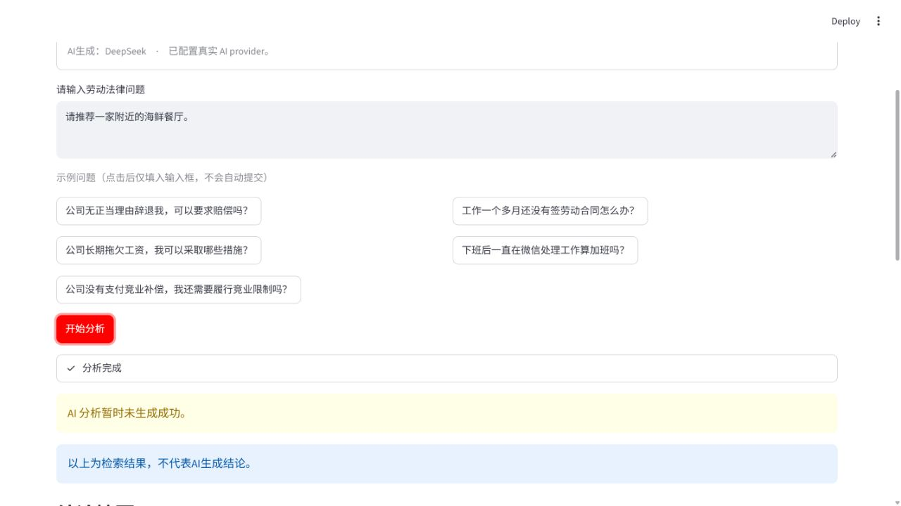
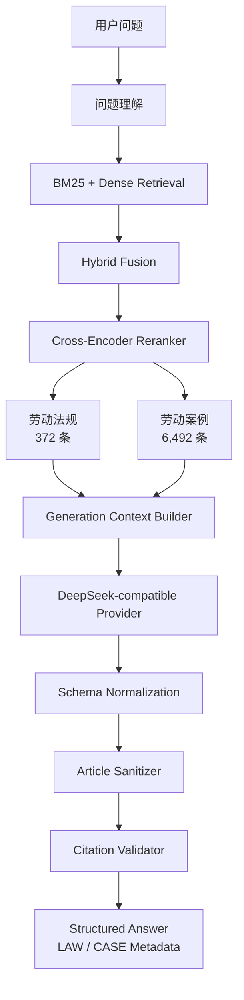

# LegalCase-Copilot

## 劳动法律信息检索与类案辅助分析系统

LegalCase-Copilot 是一个面向劳动争议场景的法律信息检索与类案辅助分析系统。项目实现了从问题理解、法规与案例检索、混合召回、Cross-Encoder Reranker 重排、上下文构建，到结构化生成、引用校验和安全 fallback 的完整流程。

本项目用于工程研究、系统演示和评测，不替代律师或其他专业法律服务，也不对具体案件作出法律结论。

## 项目概览

系统将以下能力组合为一条可审计的 production-style pipeline：

- 372 条法规及司法解释的 article-level 检索记录
- 6,492 条劳动争议案例的外部 production corpus 接口
- BM25 稀疏检索与 dense semantic retrieval
- Hybrid Retrieval 融合与 Cross-Encoder Reranker 重排
- Case-Augmented RAG：法规证据与类案证据分开检索、组合使用
- DeepSeek-compatible grounded generation
- 确定性的 `LAW-*` / `CASE-*` citation namespace
- Citation Validation、article sanitization 和安全 fallback

6,492 案例 production corpus 及其生成的 embeddings 不随本仓库发布，需要用户从具有适当来源和使用权限的渠道自行准备。

## Demo

Streamlit Demo 在同一页面提供两种模式：法规检索、法规 + 类案增强。页面会展示 provider 和 corpus 状态、结构化回答、完整法律分析、LAW/CASE citation metadata、风险提示、置信度，以及不伪造 AI 结论的 retrieval-only fallback。

### 首页

<a href="docs/images/demo-home.png"></a>

### 法规检索结果

<a href="docs/images/demo-law-only-success.png"></a>

### 法规 + 类案增强结果

<a href="docs/images/demo-case-augmented-success.png"></a>

### 安全 fallback

<a href="docs/images/demo-fallback.png"></a>

生成失败时，页面会明确标注“AI 分析暂时未生成成功”，只展示检索到的证据，不使用检索文本拼接虚假回答，也不伪造 confidence。详细启动方式见 [Demo 使用说明](docs/demo.md)。

## 核心架构



法规和案例始终保持独立的检索与引用空间：法规提供规范性依据，案例提供类案事实、争议焦点、裁判理由和结果等辅助证据。案例检索不可用时，法规-only 路径仍可运行。

## 数据与语料边界

### 法规语料

生产评测使用 372 条 article-level 法规及司法解释记录。完整法规正文、原始 DOCX/PDF 和未经确认再分发许可的派生文本不包含在公开仓库中。仓库保留 schema、metadata、provenance 说明和处理代码，用户如需重建语料，应从合适的官方来源获取文本并自行确认使用条件。

### 案例语料

- Production corpus：6,492 条劳动争议案例
- Curated benchmark：19 个案例
- Public test fixture：完全合成的小型样本，不是真实司法案例

6,492 corpus 来源于公开可访问的劳动案例数据，但不代表官方人民法院案例库，也不代表项目自动爬取中国裁判文书网。由于体积、来源和授权边界，production corpus、full-corpus embeddings、raw court PDFs 和其他外部原始数据不随仓库发布。

更多边界说明见 [THIRD_PARTY_DATA.md](THIRD_PARTY_DATA.md) 和 [评测数据公开政策](docs/evaluation_data_policy.md)。

## 检索与 RAG 流程

1. Query Processing 识别劳动法律范围和检索意图。
2. BM25 与 dense semantic retrieval 召回候选法规或案例。
3. Hybrid Fusion 融合稀疏与语义排序。
4. Cross-Encoder Reranker 对候选集合进行重排。
5. Context Builder 构建有边界、可引用的证据上下文。
6. Generation 输出结构化回答。
7. Citation Validation 校验引用是否对应真实检索证据。

模型输出中的引用不会被直接信任。`LAW-*` 和 `CASE-*` 命名空间相互独立，引用 metadata 从已验证的检索上下文中确定性生成。

## 安全与 fallback

系统在问题超出劳动法律范围、检索证据不足、生成或 schema 校验失败、引用无法对应检索上下文、模型返回不受支持条号时采用保守行为。页面会进入明确的 retrieval-only 或 evidence-insufficient 状态，不把检索结果伪装成 AI 成功回答，也不显示虚假的置信度。

## 评测结果

### Full-corpus retrieval evaluation

以下结果基于 30 条 weakly supervised full-corpus retrieval queries，不是专家人工标注基准：

| 方法 | R@1 | R@3 | R@5 |
|---|---:|---:|---:|
| BM25 | 0.8667 | 0.9333 | 0.9333 |
| Semantic | 0.5333 | 0.5667 | 0.6000 |
| Hybrid | 0.9000 | 0.9333 | 0.9333 |
| Reranker | 0.8333 | 0.9333 | 0.9333 |

### Final 30-query real generation evaluation

| 模式 | Generation success | Citation validity |
|---|---:|---:|
| Law-only | 86.67% | 100% |
| Law + 6,492 cases | 96.67% | 100% |

| 模式 | Legal-basis accuracy | Case-reference accuracy | 平均延迟 |
|---|---:|---:|---:|
| Law-only | 0.6154 | N/A | 16.91 s |
| Law + 6,492 cases | 0.6552 | 0.2126 | 36.51 s |

两种模式的 unsupported citation count 均为 0。上述指标是固定评测集上的自动指标，不等同于专家法律正确性、专业律师审查或对任意问题的保证；legal-basis accuracy 和 case-reference accuracy 也不是人工逐句事实审查。

## 快速开始

在仓库根目录执行：

```powershell
python -m venv .venv
.\.venv\Scripts\Activate.ps1
python -m pip install -r requirements.txt
python -m pip install -r frontend_demo/requirements.txt
```

复制 `.env.example` 为 `.env`。默认 provider 为离线 Mock 模式；如要使用获准的真实 provider，请仅在本机配置：

```text
LEGALCASE_LLM_PROVIDER=real
LEGALCASE_LLM_API_KEY=<your-local-key>
LEGALCASE_LLM_BASE_URL=<your-provider-base-url>
LEGALCASE_LLM_MODEL=<your-model-name>
LEGALCASE_LLM_TIMEOUT=30
```

不要提交 `.env` 或真实凭据。

法规-only 模式需要用户自行准备具有适当权限的结构化法规记录；完整法规正文和索引不随仓库发布。法规 + 类案增强模式还需要 `cases.jsonl`、`case_embeddings.npy` 和 `case_embedding_index.json`，放在 `data/processed/full_cases/`，或通过 `CASE_CORPUS_PATH` 指定等价目录。仓库不会自动下载未知来源的数据；缺少这些文件时，Demo 应明确提示 production case augmentation 不可用，并继续提供法规-only 模式。

启动 Demo：

```powershell
powershell -ExecutionPolicy Bypass -File scripts/run_web_demo.ps1 -Port 8503
```

打开 <http://localhost:8503>。

运行测试：

```powershell
python -m pytest tests
```

公开 clone 的测试以 unit test 和 synthetic fixture contract test 为主；依赖未发布外部语料的 integration test 会明确 skip。当前公开 clone 验证结果为 85 passed、90 skipped、1 warning。

## 项目结构

```text
backend/        # Provider、检索、RAG、生成与引用校验
data/           # 本地 metadata 与外部运行时语料边界
docs/           # 架构、Demo、评测与 provenance 文档
evaluation/     # 可复现评测脚本与脱敏指标产物
frontend_demo/  # Streamlit 展示层
scripts/        # 检索、索引和 Demo 工具
tests/          # 单元测试与合成 fixture 测试
```

## 局限性

- 自动评测不等同于专业律师审查或法律正确性认证。
- Full-corpus case relevance 主要使用 weak supervision 和自动指标评估。
- 类案增强模式由于案例检索与生成，延迟显著高于法规-only 模式。
- 真实 provider 运行需要网络访问和本机凭据。
- 外部语料的获取、处理、再分发和 licensing 由使用者自行负责。

## 免责声明

本系统用于劳动法律信息检索和类案辅助分析，不构成正式法律意见。具体争议请结合完整证据并咨询专业法律人士。

## 文档

- [Demo 使用说明](docs/demo.md)
- [系统架构](docs/architecture.md)
- [评测报告](docs/evaluation_report.md)
- [评测数据公开政策](docs/evaluation_data_policy.md)
- [数据来源说明](docs/data_sources.md)
- [案例数据规范](docs/case_data_spec.md)
- [第三方数据与 provenance 边界](THIRD_PARTY_DATA.md)
- [MIT License](LICENSE)
